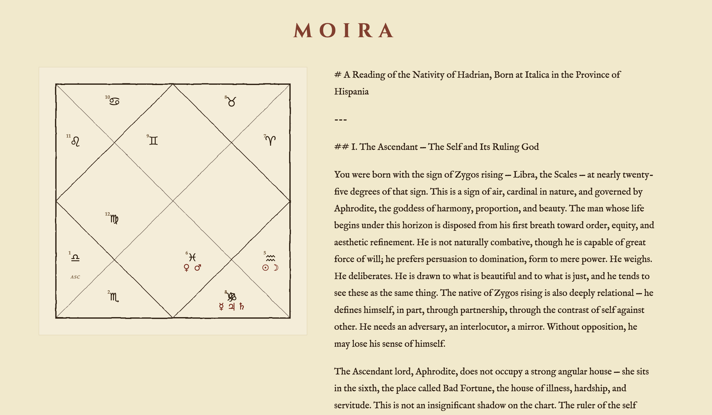

# Moira

Hellenistic natal chart readings generated by Claude, rendered as a classical square chart.

Enter a birth date, time, and place. Moira calculates a full natal chart using the Swiss Ephemeris — planetary positions, whole-sign houses, essential dignities, Greek Lots, and whole-sign aspects — then passes the structured data to Claude, instructed to read it as an Alexandrian astrologer of the second century would. The result is a full written reading alongside a hand-drawn-style SVG chart.



---

## Features

- Whole-sign houses with Ascendant and Midheaven
- Essential dignities — domicile, exaltation, triplicity, Egyptian bounds, face/decan
- Sect (diurnal/nocturnal) applied to all seven traditional planets
- Seven Greek Lots — Fortune, Spirit, Eros, Necessity, Courage, Victory, Nemesis
- Whole-sign aspects with quality (harmonious, tense, confrontational)
- Oikodespotes identification — the patron deity governing the nativity
- Server-side SVG chart in the traditional Hellenistic square format
- Geocoding and automatic timezone conversion from place name

## Stack

- **Backend:** Python, FastAPI, pyswisseph, geopy, timezonefinder
- **AI:** Anthropic Claude API (`claude-sonnet-4-6`)
- **Frontend:** Vanilla HTML/CSS (Cinzel + IM Fell English)

## Setup

```bash
pip install -r requirements.txt
```

Create a `.env` file in the project root:

```
ANTHROPIC_API_KEY=your_key_here
```

Run:

```bash
cd backend
python3 -m uvicorn main:app --reload
```

Then open `http://localhost:8000`.

## Sources

- Ptolemy, *Tetrabiblos* (c. 150 CE)
- Chris Brennan, *Hellenistic Astrology: The Study of Fate and Fortune* (2017)
